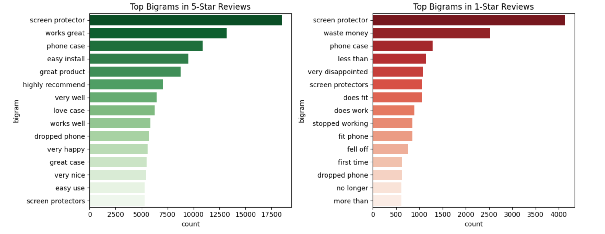

# Predicting Amazon Review Ratings from Text
This project uses Natural Language Processing (NLP) to classify Amazon product reviews based on the written text. The goal is was to gain consumer insight by leveraging text-based features and machine learning models.

## Dataset
Source: [Amazon Product Reviews](https://www.kaggle.com/datasets/divyaprakashr/amazon-products) on Kaggle
Size: 500,000+ reviews
Key Columns:
- review_text: Freeform customer review content
- rating: Target variable (integer from 1 to 5)
- verified_purchase, helpful_vote, category, and other metadata

## Preprocessing
1. Handled missing values in title and review_text
2. Analyzed rating distributions (found left-skewed pattern)
3. Cleaned text using:
- Tokenization and lowercasing
- Stopword removal
- Sentiment scoring (TextBlob)
- Emoji detection
- Bigrams (CountVectorizer)

## Insights
  
### Most Commons Phrases in 1-star vs 5-star Reviews
I used CountVectorizer to determine the phrase frequency of 1-star vs 5-star reviews. The resulting bigrams displayed a clear difference Customer Satisfaction level and could point to the common issues consumers found with these products.  

### Topic Modeling by Rating
I lemmatized the review text then processed using LDA to find the most popular themes for each rating category (1 vs 5-stars). 
- Words like useless and small were used more frequently with 1-star reviews whereas great, love, and easy frequented 5-star reviews. 

### Sentiment Analysis vs Star Rating
The intention behind my model was the predict the star rating using only review text through
- Naive Bayes
- Logistic Regression
- Random Forest 
And to evaluate using Accuracy, F1 Score, and a Confusion Matrix. The resulting F1 score was 0.81 which could likely be improved with adjustments to the model.

## Future Work
- We could focus on the Products with the most reviews to get insight on how to make improvements.
- We could also balance the classes by down-sampling higher ratings. 

## Tools
- Python (Pandas, NumPy, Scikit-learn)
- TextBlob, Gensim, Seaborn, Matplotlib
- Jupyter Notebook

